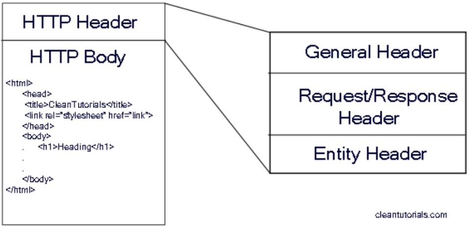

# Práctica 14: POST Requests

> Segunda Parcial

- FACULTAD DE TELEMATICA
- INGENIERÍA EN SOFTWARE
- “4ºG”
- PROGRAMACIÓN WEB
- CATEDRATICO: ULIBARRI IRETA CARLOS
- AGUIRRE ROMERO RAMÓN ALEJANDRO

## OBJETIVO

Cuando la petición es mediante el método POST, el query string es “movido” hacia el “body” y para acceder a su contenido es necesario “parsear” el contenido del “Body” de la petición y obtener la información. La información que “viaja” durante la petición, puede ser en formato de texto o en formato JSON, dependiendo de la necesidad.

Para “sacar” la información del “body”, debemos instalar un “middleware” que nos permita extraer su contenido, ya sea en formato de texto o en formato JSON. Para lograr ese objetivo, instalaremos el paquete “bodyparser” desde la línea de comando

> ENTREGA: VIERNES 06 DE MAYO DEL 2022

## EXPLICACIÓN DEL PROCESO

1. Crea una carpeta llamada "practica_14"

2. Inicializa NPM con npm init -y

3. Instala los paquete express con npm i express y nodemon con npm install -g nodemon

4. Instala el paquete 'ejs' con el comando npm i express --save o npm i ejs

5. Crea un nuevo archivo server.js en el cual se le pasara todo el codigo hecho en la practica anterior

6. Crea una nueva carpeta llamada "public" dentro de la carpeta "practica_13"

7. Dentro de la carpeta "public" crea un nuevo archivo style.css

8. Dentro del archivo style.css se le escribira body y dentro de este tendra un front-family : 'Roboto Condensed', sans-serif ademas se definira el color del texto como azul y en el h1 como rojo;

9. En el archivo server.js con el app.use donde tenemos la carpeta virtual llamada "assets" y ese nombre sera mapeado con la carpeta fisica llamada "public"

10. Despues de la linea cuatro se inserta el codigo con el que se espesifica la app de express y su engine ejs

11. Ahora en el archivo server.js se colocara un html basico dentro del app.get de la pagina principal del servidor

12. En el archivo index.ejs se creara un formulario para dos elementos el nombre y el apellido pero ademas se tendra un boton que realizara un Submit

13. Pasando al archivo server.js se creara un app.post el cual se ubicara en la direccion /student y lo que enviara es el primer nombre y el apellido en un string (Siendo que anterior mente se tomo el dato del index.ejs)

14. En el app.get de student se colocara un render de index

15. Ahora se ejecuta el comando "npx nodemon server en la terminal y acccede a http://localhost:3000/student para observar el resultado

16. Por ultimo se puede proba ingresar informacion en los cuadros de textos y al precionar el boton se podra observar el resultado

## RECURSOS

- https://www.npmjs.com/
- https://ejs.co/
